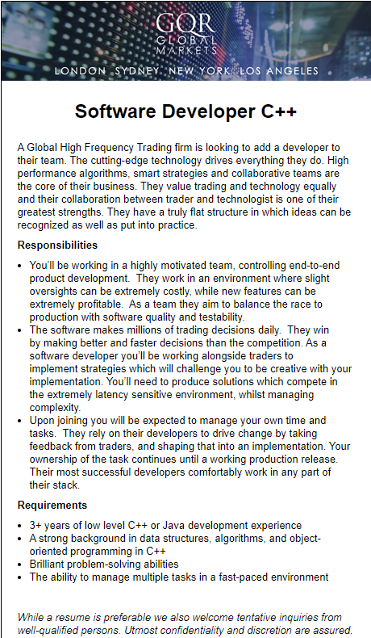
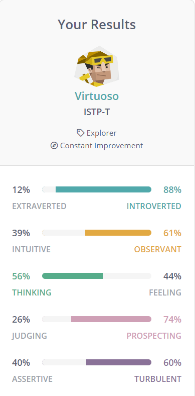
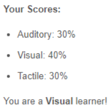
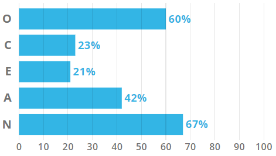

<html>
<head>
  <h1>My Profile</h1>
    <h2>Information:</h2>
      <h3> Name:</h3>
        
 Kyle Winfield

      <h3> Student Number</h3>
        
 s3541867

      <h3> Background</h3>
        
I’m a 23-year-old student of English/Irish/Scottish descent. My highest education is a completed year 12 (VCE) in 2014. I only speak English.
I own a bullmastiff pup that weighs 60kg with more room to grow!
I also like to spend my time playing in competitive Esports teams.
        

</head>
<body>
        <h2> Interest in IT</h2>
          
 My interest in IT started at a young age from spending a lot of time on the computer, primarily to play video games but because of that I learnt how to use the computer and naturally had to troubleshoot issues I had in order to play my video games.
           
          Later on, I developed an interest in computer networking from a subject I studied in high school and it sparked some interest for me to pursue more knowledge in the IT industry.
           
           
          I chose to come to RMIT because I was interested in online study, and from the online study options, it was in my opinion the most reputable university that was offering an IT degree.
          I expect to learn primarily how to code but also touch on other IT industry knowledge for future employability.
        

        <h2> My Ideal Job</h2>
        

          <a href="https://www.seek.com.au/job/39454384?type=standard#searchRequestToken=212e2e81-e954-41da-aa1b-f2ae98c83ed3">
          
             
            (click image for link to ad)
          </a>
           
           This position would suit me a lot, it is a software development job that requires very efficient programming for the firm that needs it. Being a trading firm, their programs would need to be very fast and able to handle complexity as they make millions of trading decisions per day.
           I am very interested in working with this type of high-pressure situation of developing software that needs to be finely combed for any problems. The sensitive nature of changes in the programs appeals to me also.
            
            
           As per the ad’s request, I would need to have 3+ years of low level C++ or Java development experience, a strong background in data structures, algorithms and object-oriented programming in C++ as well as the ability to manage multiple tasks and problem solving in a fast-paced environment.

           Currently, I have no experience, qualifications or skills in software development. But I plan to obtain the skills required for this type of work by firstly completing my Bachelor of IT.
            
            
           Afterwards, I plan to get an entry level job doing any kind of software development, ideally using C++. Hopefully working this job will allow me to develop the other skills required for the job above.
          

      <h2>Personality:</h2>
        <h3>Myers-Briggs Test:</h3>
          
           
        <h3>Learning Style Test:</h3>
          
           
        <h3>Big Five Personality Test:</h3>
          
           

        
 The results of these test aren’t very surprising to me, I feel as though they describe my personality fairly accurately and I accept that.
            These results indicate that I could be difficult to get to participate in a team, as I am fairly introverted and not very self-disciplined; and as such, I will need to make an effort to ensure I am doing my part in a team in terms of participation and completing work that needs doing when my team needs it.
             
        

      <h2>Project Idea:</h2>
        

          My project idea is to create a service, designed for live events, that will give clients simple solutions for live and post-production video needs. This would include creating custom broadcast graphics, video switching from multiple sources, audio mixing, creating special effects, live streaming and recording. This service would also provide all hardware required as well as setting up and working with the client to produce a good event.
Some examples of the types of live events this service would cover are things like Corporate events, conventions of all kinds, pro sports matches and/or tournaments or any event/meeting/gathering in which a client wants to broadcast something happening.

As more and more events are held, the need for online marketing and exposure is also needed. According to Facebook, users watch live videos for 3x longer than recorded footage. According to Digitell, 30% of people who watched a live stream of an event will attend that same event next year in person.
With these kinds of statistics, we can clearly see the value of live streaming, the service I want to make will allow businesses that will want to invest in live streaming to be able to do so easily with one service.

There are lots of different aspects to this project and as such it incorporates many different fields of IT such as networking, graphic editing, software development and IT service management.
When hired for a job, this service will work with work with the event/convention organizer to produce a schedule that will outline what is happening when and where. This will also give this service an idea of what equipment/hardware is needed for what parts of the event; how much equipment/hardware and what staff need to be there in order to operate the equipment/hardware.
 
The service will need to manage multiple video sources to appear on the live stream as per the schedule along with any graphical or special effects to overlay the video source(s). It will need to do the same with audio sources (if multiple), if some sources appear off screen they need to be turned off or maybe not depending on the schedule’s specifications.
 
Custom graphical design will also be created as per the client's needs/requests. Things like stream overlays, re-creating logos/images (includes resizing, transparent versions etc.) for the purpose that they need to serve, or animations for things like transitions.
Special effects can be made if the client requests and will be made to their liking. The limits of the special effects will be that of the software the service has and the money/time investments that are made.
 
The streaming platform will also be discussed with the client as there are different options depending on the client’s liking, things like YouTube, Facebook, Twitch, etc. These can all be set up by using this service. Another option is for the service to set up the stream to be embedded on their own business website if they like.
There will also be recording for the clients, during live streams the content will be recorded and stored for whatever purpose they might want. This could just be a raw upload of an entire presentation at the event, or they could use the footage for any promotional material they want to create.

The hardware this service will require is fully HD live stream capable cameras, tripods, video switching equipment, microphones, networking switches and cabling, data storage compatible with networking and some PCs that are compatible with this equipment.
The software this service will require OBS (Open Broadcast Software), an open source broadcasting software, as well as a graphics and video editing software.

The skills required for this service will be a knowledge of setting up and using all the required hardware, being able to use all software, graphic editing skills, technical knowledge of PCs, networking, encoding, bitrates, Java Script, embedding code and other relevant technical IT concepts.
 
There will also be a need for customer service, communication and teamwork skills in general as this service will require cooperation between several people working on it as well as cooperation from the event organizers.

If this project is successful, many events, conventions, businesses etc. will have their content more accessible, and marketable to the public while doing so in a professional manner. It will broaden the viewership and attract new potential attendees to these events in the future.
 
All in all, this service will grow events/conventions from the live streams quality that this service will provide. If the live stream is successfully a quality production, the viewership will grow and so will the events.

        <h2> References:</h2>
        

        Eventbrite US Blog. 2020. 5 Myths About Livestreaming An Event — Busted.
         
        [online] Available at:
        <a href="https://www.eventbrite.com/blog/livestreaming-an-event-myths-busted-ds00/"> https://www.eventbrite.com/blog/livestreaming-an-event-myths-busted-ds00/</a> [Accessed 19 March 2020].
        

</body>
</html>
